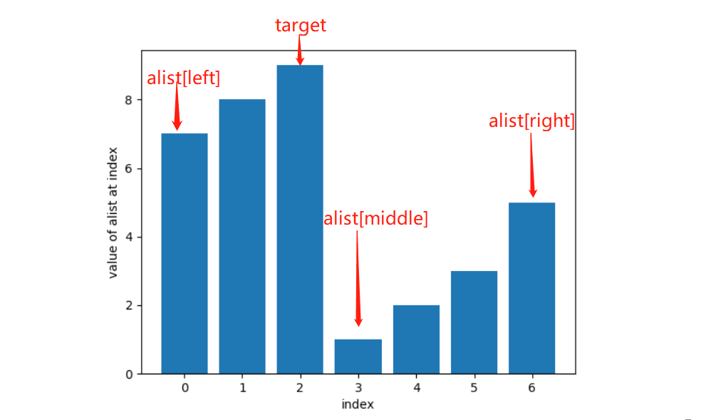

# Leetcode 33. Search in Rotated Sorted Array

### Question:

Suppose an array sorted in ascending order is rotated at some pivot unknown to you beforehand.

\(i.e., `[0,1,2,4,5,6,7]` might become `[4,5,6,7,0,1,2]`\).

You are given a target value to search. If found in the array return its index, otherwise return `-1`.

You may assume no duplicate exists in the array.

Your algorithm's runtime complexity must be in the order of _O_\(log _n_\).

**Example 1:**

```text
Input: nums = [4,5,6,7,0,1,2], target = 0
Output: 4
```

**Example 2:**

```text
Input: nums = [4,5,6,7,0,1,2], target = 3
Output: -1
```

该问题的求解要充分利用Sorted和Rotated数组的特性。


该数组中，最左边的元素一定大于最右边的元素，即`alist[left] > alist[right]`。

另外这个数组可以分为左右两个子数组，这两个子数组内的值都是递增的。据此，我们可以通过`alist[left], alist[middle], target`三者之间的大小关系，来判断`alist[middle]`位于哪一个子数组。

* 如果`alist[middle]`位于左半边，即`alist[middle] >= alist[left]`，则又分为三种情况：
  * 第一种情况是`target >= alist[left] and target < alist[middle]`。我们用`middle - 1`代替`right`指针


* * 第二种情况就是`target >= alist[left] and target >= alist[middle]`。如下图，我们用`middle + 1`代替`left`指针。


* * 第三种情况是，`alist[middle]`在左子数组，但`target`在右子数组，即`target < alist[left]`。此时我们用`middle + 1`代替`left`指针。


* 如果`alist[middle]`位于右子数组，则又分为三种情况：
  * 第一种情况就是`target > alist[middle] and target <= alist[right]`，如下图。此时我们用用`middle + 1`替代`left`指针


* * 第二种情况就是`target <= alist[middle] and target <= alist[right]`，如下图，此时我们用`middle - 1`替换`right`指针。


* * 第三种情况是`target > alist[right]`，如下图。此时`target`在右子数组中。此时我们用`middle - 1`替换`right`指针



重复上面的步骤，直到收敛到`alist[middle] == target`为止，我们返回`middle`。如果不存在，则返回`-1`。

下面是完整代码：

```text
# Python
class Solution:
    def search(alist, target):
        left, right = 0, len(alist) - 1
        while left <= right:
            middle = (left + right) // 2
            if alist[middle] == target:             # 如果能收敛，则返回middle
                return middle
            elif alist[middle] >= alist[left]:      # alist[left] <= alist[middle]，说明alist[middle]一定在左子数组中。此时分三种情况
                if target >= alist[left] and target < alist[middle]:    # 第一种情况是alist[left] <= alist[middle] <= target
                    right = middle - 1
                elif target >= alist[left] and target >= alist[middle]: # 第二种情况是alist[left] < target < alist[middle]
                    left = middle + 1
                elif target < alist[left]:                              # 第三种情况是target < alist[left]
                    left = middle + 1
            elif alist[middle] <= alist[right]:     # alist[left] > alist[middle] 说明alist[middle]一定在右子数组中。此时分三种情况
                if target > alist[middle] and target <= alist[right]:
                    left = middle + 1
                elif target <= alist[middle] and target <= alist[right]:
                    right = middle - 1
                elif target > alist[right]:
                    right = middle - 1
        return -1
```

```text
// Java
class Solution {
    public int search(int[] nums, int target) {
        int left = 0;
        int right = nums.length - 1;
        while (left <= right){
            int middle = (left + right) / 2;
            if (nums[middle] == target){
                return middle;
            }else if (nums[middle] >= nums[left]){       // middle in left sub-array
                if (nums[middle] < target && target >= nums[left]){       // nums[left] < nums[middle] <= target
                    left = middle + 1;
                }else if(nums[middle] > target && target >= nums[left]){       // nums[left] <= target < nums[middle]
                    right = middle - 1;
                }else if (nums[left] > target){
                    left = middle + 1;
                }
            }else if (nums[middle] <= nums[right]){     // middle in right sub-array
                if (nums[middle] < target && target <= nums[right]){      // nums[middle] < target <= nums[right]
                    left = middle + 1;
                }else if (nums[middle] > target && nums[right] >= nums[middle]){     // target < nums[middle] <= nums[right]
                    right = middle - 1;
                }else if (target > nums[right]){
                    right = middle - 1;
                }
            }
        }
        return -1;
    }
}
```


