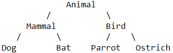
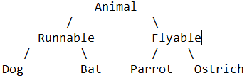
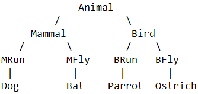

# Advanced Object-oriented Programming

多重继承：

假设我们想要实现以下四种动物：

* Dog
* Bat
* Parrot
* Ostrich

我们首先实现如下树状结构的类：



但是如果按照“能跑”（runnable）和“能飞”（flyable）来归类，我们就应该设计出这样的类的层次：



如果要把上面的两种分类都包含进来，我们就得设计更多的层次：

* 哺乳类：能跑的哺乳类，能飞的哺乳类；
* 鸟类：能跑的鸟类，能飞的鸟类。

这么一来，类的层次就复杂了：



如果要再增加“宠物类”和“非宠物类”，这么搞下去，类的数量会呈指数增长，很明显这样设计是不行的。

正确的做法是采用多重继承。首先，主要的类层次仍按照哺乳类和鸟类设计:

```python
class Animal(object):
    pass

# 大类:
class Mammal(Animal):
    pass

class Bird(Animal):
    pass

# 各种动物:
class Dog(Mammal):
    pass

class Bat(Mammal):
    pass

class Parrot(Bird):
    pass

class Ostrich(Bird):
    pass
```

现在，我们要给动物再加上`Runnable`和`Flyable`的功能，只需要先定义好`Runnable`和`Flyable`的类：

```python
class Runnable(object):
    def run(self):
        print('Running...')

class Flyable(object):
    def fly(self):
        print('Flying...')
```

对于需要`Runnable`功能的动物，就多继承一个`Runnable`，例如`Dog`：

```python
class Dog(Mammal, Runnable):
    pass
```

对于需要`Flyable`功能的动物，就多继承一个`Flyable`，例如`Bat`：

```python
class Bat(Mammal, Flyable):
    pass
```

通过多重继承，一个子类就可以同时获得多个父类的所有功能。


