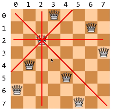

# Leetcode 51: N-Queens I

#### Leetcode 51: N-Queens


The _n_-queens puzzle is the problem of placing _n_ queens on an _n_×_n_ chessboard such that no two queens attack each other.


Given an integer _n_, return all distinct solutions to the _n_-queens puzzle.

Each solution contains a distinct board configuration of the _n_-queens' placement, where `'Q'` and `'.'` both indicate a queen and an empty space respectively.

**Example:**

```text
Input: 4
Output: [
 [".Q..",  // Solution 1
  "...Q",
  "Q...",
  "..Q."],

 ["..Q.",  // Solution 2
  "Q...",
  "...Q",
  ".Q.."]
]
Explanation: There exist two distinct solutions to the 4-queens puzzle as shown above.
```

国际象棋规则：皇后（Queen）可以在n x n的棋盘内 向上、下、左、右、左上、左下、右上、右下八个方向移动 1 ~ （n-1）个格子。



**基本思路是，我们先将一个皇后放到棋盘上任意一个格子中，然后将该皇后能攻击到的所有格子都标记出来（如上图）。然后继续放入第二个皇后，以此类推找到所有可行解。我们要知道，棋盘的每一行中有且仅有一个Queen，同样的，每一列中也有且仅有一个Queen。这个insight非常重要，因为对于减少搜索时的计算量很有帮助。**

解题步骤：

1. 首先我们先定义一个函数`is_compatible()`来判断已经放置的Queen会不会对新来的Queen造成攻击。返回值为`True`或`False`。
2. 然后用Backtracking的方法递归求解。

先来看一下`is_compatible()`的代码：

```python
def is_compatible(prev_cols_list, curr_row, curr_col):
    for prev_row in range(curr_row):
        if prev_cols_list[prev_row] == curr_col or curr_row - prev_row == abs(prev_cols_list[prev_row] - curr_col):
            return False
    return True
# prev_cols_list: 是已经遍历过的 行 中，可行的Queen们的 列的 集合（是一个数组）
# curr_row: 是新来的Queen的 行 索引（int）
# curr_col: 是新来的Queen的 列 索引（int）
```

上面代码比较难懂的地方在于①为什么用`for prev_row in range(curr_row)`；②在于`if`语句：


举个例子来解释一下①，在我们选择了0~2行的Queen的位置后（如上图所示），此时的`prev_cols_list = [3, 6, 2]`，`curr_row` 为3，`for` 循环的范围是从0到2。那么`prev_cols_list[prev_row]`就是之前被放置的Queen们的 列索引。使用这个for循环的好处在于：`for`循环本身就避免了 行冲突，即新来的Queen的行 一定不与 已被放置的Queen的 行 相同。

②再来解释下`if`语句，`if`语句的做因就是为了避免列冲突和对角线冲突。

1. 对于列冲突，我们用代码表示就是：如果`prev_cols_list[prev_row] == curr_col`，那么就返回`False`。
2. 对于对角线冲突，我们给出比较数学一点的表达是：对于任意两个Queen1和Queen2，Queen1和Queen2的行坐标之差的绝对值等于Queen1和Queen2的列坐标之差的绝对值。对角线冲突的代码表示是：`curr_row - prev_row == abs(prev_cols_list[prev_row] - curr_col)`。这里，因为`curr_row`是`prev_row`的上界，所以`curr_row`一定大于`prev_row`，所以等式左边没有加绝对值。


接下来就是Backtracking的部分。

```python
def bt(answers, positions, row, n):
    if row == n:
        answers.append(['.' * p + 'Q' + '.' * (n-1-p) for p in positions])
        return answers
    for col in range(n):
        if is_compatible(positions, row, col):
            positions.append(col)
            bt(answers, positions, row+1, n)
            positions.pop()
    return answers
# answers: 结果，2d-array
# positions: 当前递归层中，已经被放置的Queen的 列索引（对应着is_compatible函数中的prev_cols_list参数。dtype: int list）
# row: 当前被搜索的棋盘方格的 行索引
# n: 棋盘大小
```

当 `row==n`时，意味着我们已经搜索到棋盘的最后一行，此时我们将其中一个答案`append`到`answers`中并return。

我们用`for`循环遍历列，用递归遍历 行 来寻找不会被 已放置的Queen攻击的Queen的行索引和列索引。每当 当前列 满足 `is_compatible`时，我们对`row`递归。每次将`positions`的最后`pop`出来。


我们来看完整的Python代码：

```python
class Solution(object):
    def solveNQueens(self, n):
        
        def is_compatible(prev_cols_list, curr_row, curr_col):
            for prev_row in range(curr_row):
                if prev_cols_list[prev_row] == curr_col or curr_row - prev_row == abs(prev_cols_list[prev_row] - curr_col):
                    return False
            return True
        
        def bt(answers, positions, row, n):
            if row == n:
                answers.append(['.' * p + 'Q' + '.' * (n-1-p) for p in positions])
                return answers
            for col in range(n):
                if is_compatible(positions, row, col):
                    positions.append(col)
                    bt(answers, positions, row+1, n)
                    positions.pop()
            return answers
        
        answers, positions = [], []
        bt(answers, positions, 0, n)
        return answers

s = Solution()
print(s.solveNQueens(4))

>>>
[
['.Q..', '...Q', 'Q...', '..Q.'], 
['..Q.', 'Q...', '...Q', '.Q..']
]
```

Time: O\(n^n\)

Space: O\(n\)


