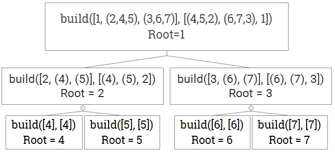

# Leetcode 889. Construct Binary Tree from Preorder and Postorder Traversal

## Leetcode 889. Construct Binary Tree from Preorder and Postorder Traversal

**Question: Return any binary tree that matches the given preorder and postorder traversals. Values in the traversals pre and post are distinct positive integers.**

* Example 1:
  * `Input: pre = [1, 2, 4, 5, 3, 6, 7], post = [4, 5, 2, 6, 7, 3, 1]`
  * `Output: [1, 2, 3, 4, 5, 6, 7]`
* Note:
  * `1 <= pre.length == post.length <= 30`
  * `pre[] and post[]` are both permutations of `1, 2, ..., pre.length`.
  * It is guaranteed an answer exists. If there exists multiple answers, you can return any of them.

**思路：假设我们有下面二叉一棵树：**


对于三种遍历方式（Preorder, Inorder, Postorder）来说，它们的顺序分别为：

* Preorder: 1 → 2 → 4 → 5 → 3 → 6 → 7
* Inorder: 4 → 2 → 5 → 1 → 6 → 3 → 7
* Postorder: 4 → 5 → 2 → 6 → 7 → 3 → 1
* **`Preorder: root, (left subtree), (right subtree)`**
* **`Inorder: (left subtree), root, (right subtree)`**
* **`Postorder: (left subtree), (right subtree), root`**

**特殊性质：**

1. Preorder 和 Postorder：去掉`pre = [1, 2, 4, 5, 3, 6, 7]`

   的第一个元素后，剩下元素的中的第一个（2）就是该二叉树的左子树的根节点。`pre`的第一个元素一定是该二叉树的根节点。

2. 然后我们在`post = [4, 5, 2, 6, 7, 3, 1]`中，对左子树的根节点（2）进行搜索。由于元素是不重复的，所以（2）一定是该二叉树根节点（1）的左子节点。
3. 根据上面`Postorder`中提到的，我们知道在后序遍历中，根节点一定在最后。那么该左子树根节点（2）之前的元素（4，5）就应该分别是该左子树根节点（2）的左、右子节点。
4. 该左子树根节点（2）右边的元素（6，7，3）一定位于该二叉树根节点的右子树中。（`post`的最后一个元素是该二叉树的根节点）。另一个能获得的信息是该左子树的大小为3（该子树为：root: 2, left node: 3, right node: 5）。
5. 根据上面这四步，我们就能递归的求解该问题：

Pseudo code如下图：



`build(pre, post)`，`pre`分为`[root, (left subtree), (right subtree)]`；`post`分为`[left subtree), (right subtree), root]`

$$
\text{Time Complexity: Best: }O(n\log(n)) \text{, Worst: }O(n^2) \\
\text{Space Complexity: Best: } O(\log(n)) {, Worst: }O(n)
$$

**Code \(Python\):**

```python
# Definition for a binary tree node:
# class TreeNode:
#   def __init__(self, x):
#     self.val = x
#     self.left = None
#     self.right = None

class Solution:
  def constructFromPrePost(self, pre, post):
    def build(i, j, length):                               # i，j分别表示在pre和post数组中的起始位置，length表示当前数组的长度
      if length <= 0:
        return None
      root = TreeNode(pre[i])
      if length == 1:
        return root
      k = j                     
      while post[k] != pre[i+1]:                           # 用 k 找到 左子树根节点的位置
        k += 1
      l = k - j + 1                                        # 求出当前左子树的长度
      root.left = build(i + 1, j, l)                       # 递归求解。要空出前 i 个元素，因为 i 是已经安放的节点
      root.right = build(i + l + 1, k + 1, length - l - 1) # 递归求解。要空出后 l + 1 个元素，因为 这些元素是已经安放的节点
      return root
    return build(0, 0, len(pre))
```


#### 另一种解法（Python）（Copied From My Leetcode Solution）：

```python
# Definition for a binary tree node.
# class TreeNode:
#     def __init__(self, x):
#         self.val = x
#         self.left = None
#         self.right = None

class Solution:
    def constructFromPrePost(self, pre: List[int], post: List[int]) -> TreeNode:
        if not pre or not post:
            return None
        root = TreeNode(pre[0])
        if len(pre) == 1 or len(post) == 1:    # 必须要有这个Base case，因为我们要确保 pre和post的长度大于 1，这样才能说明当前层的节点 是有 子节点（或子树）的
            return root
        for i in range(len(post)):            # 寻找 当前层节点的左子节点（即左子树的根节点）
            if post[i] == pre[1]:            # 注意！这里用的是 pre[1] 而不是 pre[0]，是因为我们每次要找的是 左子树的根节点。这也是为什么我们有两个Base case。
                root.left = self.constructFromPrePost(pre[1:i+2], post[:i+1])    # 括号中为什么要用这些索引的原因可以参考下面Code Block的图示
                root.right = self.constructFromPrePost(pre[i+2:], post[i+1:-1])
                return root
# 代码解释见下一个Code Block！
```

个人认为这个方法更加易懂一些，但其实上原理是一样的。还是这三条原则：

* **`Preorder: root, (left subtree), (right subtree)`**
* **`Inorder: (left subtree), root, (right subtree)`**
* **`Postorder: (left subtree), (right subtree), root`**

```text
还是上面的两个input数组：
pre =  [1, 2, 4, 5, 3, 6, 7]
post = [4, 5, 2, 6, 7, 3, 1]

我们知道，pre的第一个元素（1）一定是root；post的最后一个元素（1）也一定是root。
然后，对于pre中剩下的元素pre[1:]（2，4，5，3，6，7），第一个元素（2）一定是这棵树第二层的左子节点。
那么，在以（2）为根节点子树中，有多少个元素呢？
此时，我们到post中找到元素 2 的位置，记为 i。(此时 i = 2)那么，post数组中的元素 2 之前的所有元素（包括2）就都位于 以 2 为根节点的左子树中。（包括4，5，2）
记住，（4，5，2）对应的是(left, right, root)的顺序。
同理，元素 2 之后（不包括2）的所有元素（不包括最后一个元素，因为最后一个元素是 2 的root）就都在右子树中。
再次，（6，7，3）对应着（left, right, root)，所以 3 就是这棵树第二层的 右子节点。
不断重复上述过程，就能重构这棵树了。

下面是图示：
第一层递归：
     root  left_subtree_root
        |  |
pre =  [1, 2, 4, 5, 3, 6, 7]
post = [4, 5, 2, 6, 7, 3, 1]
              |
        left_subtree_root, i = 2
1. 先写Base case，创建 root = TreeNode(pre[0])
2. 那么pre[1]（第二个元素就是left_subtree_root）
3. 然后做遍历查找 left_subtree_root（左子树的根节点，即左子节点），并得到该节点索引值 i = 2
4. 在pre中，（2，4，5）用 i 表示就是 pre[1:i+2]。（3，6，7）用 i 表示就是 pre[i+2:]
5. 同理，在post中，（4，5，2）用 i 表示就是 post[:i+1]。（6，7，3）用 i 表示就是 post[i+1:-1]
6. 最后，在每一层递归中都 return root 即可。
```


