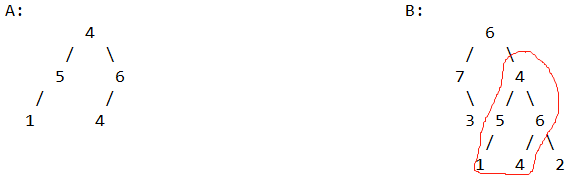

# 判断二叉树A是不是二叉树B的子结构

#### 问题：

判断二叉树B是不是二叉树A的子结构

例如：


#### 思路：

首先应该定义一个函数来比较B中每一个子树是否与A相同。我们要能想到几种可能的情况：

1. （对当前节点的比较）root1.val != root2.val  --&gt; return False   
2. （对左子树的比较，要用递归）compare\(root2.left, root1\)
3. （对右子树的比较，要用递归）compare\(root2.right, root1\)
4. Base Case中又分为两种情况：
   1. 一种是 root1 为空，此时我们认为 root1 是 root2 的子结构
   2. 反之，root2 为空，我们认为 root1 不是 root2 的子结构

所以我们可以这样写：

```python
def compare(root1, 1):
    if not root1:
        return True
    if not root2:
        return False
    return compare9
```




