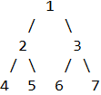
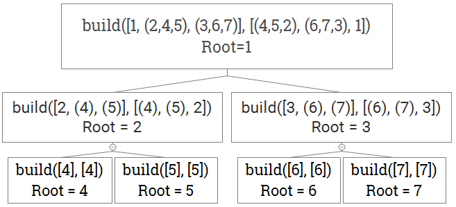

# Leetcode 889. Construct Binary Tree from Preorder and Postorder Traversal

#### Question: Return any binary tree that matches the given preorder and postorder traversals. Values in the traversals `pre` and `post` are distinct positive integers.

* Example 1:
  * `Input: pre = [1, 2, 4, 5, 3, 6, 7], post = [4, 5, 2, 6, 7, 3, 1]`
  * `Output: [1, 2, 3, 4, 5, 6, 7]`
* Note:
  * `1 <= pre.length == post.length <= 30`
  * `pre[] and post[]` are both permutations of `1, 2, ..., pre.length`.
  * It is guaranteed an answer exists. If there exists multiple answers, you can return any of them.

#### 思路：假设我们有下面二叉一棵树：



对于三种遍历方式（Preorder, Inorder, Postorder）来说，它们的顺序分别为：

* Preorder: 1 → 2 → 4 → 5 → 3 → 6 → 7
* Inorder: 4 → 2 → 5 → 1 → 6 → 3 → 7
* Postorder: 4 → 5 → 2 → 6 → 7 → 3 → 1
* `Preorder: root, (left subtree), (right subtree)`
* `Inorder: (left subtree), root, (right subtree)`
* `Postorder: (left subtree), (right subtree), root`

#### 特殊性质：

1. Preorder 和 Postorder：去掉`pre = [1, 2, 4, 5, 3, 6, 7]`

   的第一个元素后，剩下元素的中的第一个（2）就是该二叉树的左子树的根节点。`pre`的第一个元素一定是该二叉树的根节点。

2. 然后我们在`post = [4, 5, 2, 6, 7, 3, 1]`中，对左子树的根节点（2）进行搜索。由于元素是不重复的，所以（2）一定是该二叉树根节点（1）的左子节点。
3. 根据上面`Postorder`中提到的，我们知道在后序遍历中，根节点一定在最后。那么该左子树根节点（2）之前的元素（4，5）就应该分别是该左子树根节点（2）的左、右子节点。
4. 该左子树根节点（2）右边的元素（6，7，3）一定位于该二叉树根节点的右子树中。（`post`的最后一个元素是该二叉树的根节点）。另一个能获得的信息是该左子树的大小为3（该子树为：root: 2, left node: 3, right node: 5）。
5. 根据上面这四步，我们就能递归的求解该问题：

Pseudo code如下图：



`build(pre, post)`，`pre`分为`[root, (left subtree), (right subtree)]`；`post`分为`[left subtree), (right subtree), root]`

$$
\text{Time Complexity: Best: }O(n\log(n)) \text{, Worst: }O(n^2) \\
\text{Space Complexity: Best: } O(\log(n)) {, Worst: }O(n)
$$

#### Code \(Python\):

```python
# Definition for a binary tree node:
# class TreeNode:
#   def __init__(self, x):
#     self.val = x
#     self.left = None
#     self.right = None

class Solution:
  def constructFromPrePost(self, pre, post):
    def build(i, j, length):    # i，j分别表示在pre和post数组中的起始位置，length表示当前数组的长度
      if length <= 0:
        return None
      root = TreeNode(pre[i])
      if length == 1:
        return root
      k = j
      while post[k] != pre[i+1]:
        k += 1
      l = k - j + 1
      root.left = build(i + 1, j, l)
      root.right = build(i + l + 1, k + 1, length - l - 1)
      return root
    return build(0, 0, len(pre))
```


